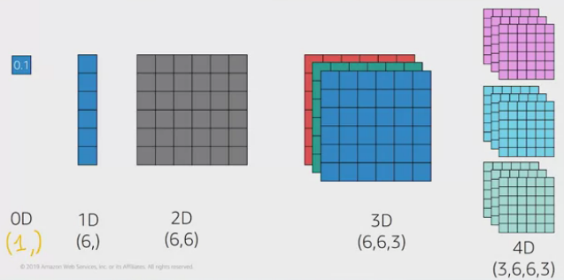

# AWS and Computer Vision

__GluonCV__
* GluonCV (runs on apache mxnet engine): a deep learning toolkit for computer vision
    * image classification
    * object detection
    * semantic / instance segmentation
    * pose estimation
* created and maintained by AWS
* Java, Maven, Linux, CPU: 
    * https://mxnet.apache.org/get_started/java_setup.html
    * https://gluon-cv.mxnet.io/install.html

__computer vision tasks:__
* object detection models - with YOLO (Real-Time Object Detection)
* semantic / instance segmentation
* pose estimation

__sources__
* cloudera: AWS Computer Vision: Getting Started with GluonCV
* mxnet support ONNX: https://onnx.ai/supported-tools.html

## Amazon ML Stack
* AI Services: contains high level API's for vision, speech, language, ...
* ML Services: contains Amazon SageMaker
* ML Frameworks & Infrastructure: contains DL frameworks (tensorflow, mxnet, ...)

## Amazon Rekognition
* for image and video analysis
* provides simple API for usage

## Amazon SageMaker
* amazon sagemaker has a service for labeling for supervised learning. ex. when classification a dog image. on train a human has to label it: 
    * a flag: yes it is a dog
    * pixel coordinates of the dog in the image
* a jupyter notebook with preinstalled (CONDA environments) _apache mxnet, tensorflow, pytorch, chainer_ and non-deeplearning frameworks _scikit-learn and Spark ML_.
* in the jupyter notebook you can write your own ML models, train it, ...
* or you can use build-in algorithms: _K-Means, K-Nearest Neighbors (k-NN), BlazingText_, ...
* further algorithm by 3rd pary is listed in AWS Marketplace
* you can train a model __locally__ on amazon sagemaker notebook or use __model training jobs__ (needed infrastructure / instances is created instantly)
* model is stored is S3
* model optimization jobs: compiles the trained model into exe
* deployment
    * __amazon sagemaker endpoint__: http request
    * __AWS IoT Greengrass__: for deployment on edge devices; see also Amazon SageMaker Neo
* the workflow is controlable by AWS CLI 
* or SDK's in python `import sagemaker`

## AWS Deep Learning AMI
* Deep Learning Amazon Machine Images: DLAMI
* AMI is a template to create a virtual machine (instance) in EC2 (Amazon Elastic Compute Cloud)
* an AMI includes the OS and any additional software / dependency
* its like purchasing an computer. it has an OS and additional programs
* the DLAMI provides different OS (Ubuntu, Amazon Linux, Windows), preinstalled DL frameworks (mxnet, tensorflow, ...) and Nvidia CUDA drivers
* if you create an DLAMI instance with EC2 then you can access it with SSH (private/public key). you access the instance with the public DNS: `ssh -i "private-key.pem" ubuntu@ec2-...-compute-amazonaws.com`. do not forget to shutdown the instance (for cost reasons). and also delete the instance because you'll get charged for the storage.

## AWS Deep Learning Containers
* these containers provide just another way to set up a _deep learning environment_ on AWS with optimized, prepackaged, container images
* amazon provides a docker container repository: Amazon Elastic Container Registry (ECR)
* Amazon Elastic Container Service: Amazon ECS. ECS do the container orchestration.
* So what are Deep Learning Containers? _These are Docker container images pre-installed with deep learning frameworks_ 
* you can deploy container on:
    * ECS
    * Amazon Elastic Kubernetes Services: Amazon EKS
    * EC2 with DLAMI: connect to instance (with SSH) then docker run
    * on your own machine: Docker and Amazon CLI has to be installed

## GluonCV
* GluonCV implements models for image classifications. 
* these models are accessible in __model zoo__.
* these models are pre-trained on public available dataset with millions of images.

### image classification dataset
* __CIFAR-10__ (Canadian Institute for Advanced Research) used over 10 years for computer research. it includes 10 basic classes: cars, cats, dogs, ...
* __ImageNet__ is another images classification dataset. with 14 mio images and 22.000 classes. refered as ImageNet22k. check also Imagenet1k.

### neuronal network models for image classification
* there are a lot of different models architectures (classification model architectures)
* __ResNet__ is popular
* __MobileNet__ is good for mobile phones
* or: VGG, SqueezeNet, DenseNet, AlexNet, DarkNet, Inception, ...
* how to decide which model to take? accurary, samples per seconds, ...

## neuronal network essentials
* module 3 > lesson 5
* a fundamental network is called the __fully connected network__
* is called fully connected because all inputs are connected to outputs
* its a general purpose network that makes no assumption about the input data
* ex. image. an image is composed of pixels. and each pixel of an RGB image will have three values that encode the intensity of red, green and blue colors.
* more simplified example imagine we have a 4x4 pixel gray scale image
    * each pixel represent the intensity: 0 is black and 1 is white
    * now all pixels are flattened for the first layer: pixel to input
* all connections are weighted
    * with this weights the activation function is activated and produces the output
    * therefore the train objective is to find the best weights
* these connection weights are called also __network parameters__
    * real world models have billions of network parameteres or even more
* pre-trained models good network parameter have been learned already
    * we download a file with these values and create a model based on it

### convolutional neural networks
* used in computer vision tasks
* two most important operations: the convolution operation and the max-pooling operation

## Module 4: Gluon Fundamentals
* Understand the mathematics behind NDArray
* Understand when to use different Gluon blocks including convolution, dense layers, and pooling
* Compose Gluon blocks into complete models
* Understand the difference between metrics and loss 

### N-dimensional arrays
* ndarrays also called __tensors__
* vectors and matrices of N-dimensions
* used in deep learning to represent input, output, ...

