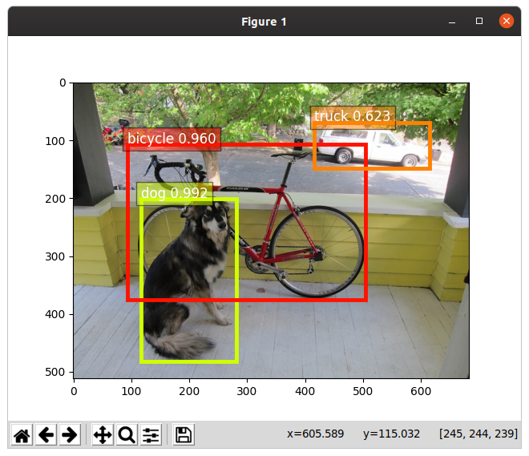
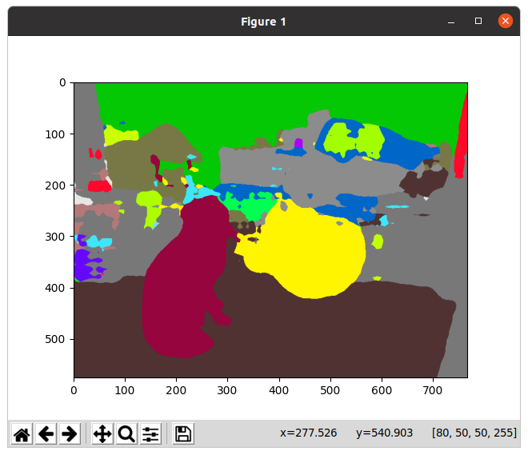

image classification
--------------------
``` 
# 1 volcano (83.2%)
# 2 alp (5.06%)
# 3 valley (0.624%)
# 4 mountain tent (0.537%)
# 5 lakeside (0.496%)
``` 

object detection
--------------------


image segmentation
--------------------

